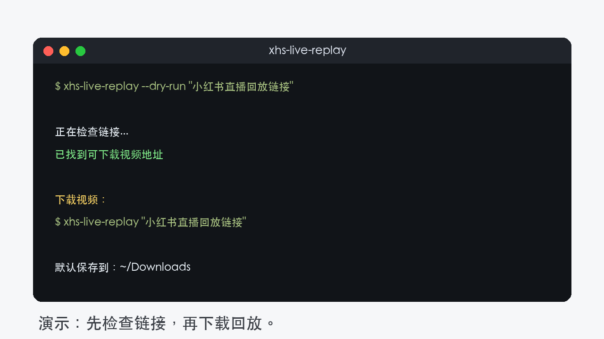

# 小红书直播回放下载

一个小工具：给它小红书直播回放链接，它帮你下载视频。

> 目前只在 macOS 测试过。



## 安装

需要先安装 Homebrew。

```bash
curl -fsSL https://raw.githubusercontent.com/cyanskye/xhs-live-replay-downloader/main/scripts/install-macos.sh | bash
```

这个脚本会帮你准备下载需要的工具。

## 使用

先检查链接能不能下载：

```bash
xhs-live-replay --dry-run '<小红书直播回放链接>'
```

开始下载：

```bash
xhs-live-replay '<小红书直播回放链接>'
```

默认保存到：

```text
~/Downloads
```

保存到指定文件夹：

```bash
xhs-live-replay --output-dir ./downloads '<小红书直播回放链接>'
```

## 不安装也可以用

```bash
npx github:cyanskye/xhs-live-replay-downloader --dry-run '<小红书直播回放链接>'
```

```bash
npx github:cyanskye/xhs-live-replay-downloader '<小红书直播回放链接>'
```

## 支持哪些链接

目前测试过这两类：

```text
https://www.xiaohongshu.com/fe/live-h5/page/live_replay/...
https://www.xiaohongshu.com/hina/livereplay/...
```

如果链接已经失效、需要登录、需要验证码，工具会停止，不会尝试绕过。

## 给 Codex 用

这个仓库也带了一个 Codex Skill：

```text
codex-skill/xhs-live-replay-downloader
```

安装好 CLI 后，可以把这个文件夹放进你的 Codex skills 目录。之后直接对 Codex 说：

```text
下载这个小红书直播回放：<链接>
```

## 项目目录

```text
bin/            命令行工具
scripts/        macOS 安装脚本
codex-skill/    Codex Skill
docs/images/    演示图片
```

这个结构是刻意分开的：普通用户用 `bin/` 里的命令，Codex 用户用 `codex-skill/`。

## 说明

- 不需要小红书账号。
- 不读取浏览器 cookie。
- 不批量抓取。
- 一次处理一个回放链接。
- 只下载你有权保存的内容。

---

# Xiaohongshu Live Replay Downloader

A small tool for downloading Xiaohongshu live replay videos.

> Tested on macOS only.


## Install

Homebrew is required.

```bash
curl -fsSL https://raw.githubusercontent.com/cyanskye/xhs-live-replay-downloader/main/scripts/install-macos.sh | bash
```

## Use

Check a link first:

```bash
xhs-live-replay --dry-run '<xiaohongshu live replay url>'
```

Download:

```bash
xhs-live-replay '<xiaohongshu live replay url>'
```

The video is saved to:

```text
~/Downloads
```

Choose another folder:

```bash
xhs-live-replay --output-dir ./downloads '<xiaohongshu live replay url>'
```

## Run Without Installing

```bash
npx github:cyanskye/xhs-live-replay-downloader --dry-run '<xiaohongshu live replay url>'
```

```bash
npx github:cyanskye/xhs-live-replay-downloader '<xiaohongshu live replay url>'
```

## Codex Skill

The Skill is here:

```text
codex-skill/xhs-live-replay-downloader
```

After installing the CLI, copy that folder into your Codex skills directory and ask Codex:

```text
Download this Xiaohongshu live replay: <url>
```

## Notes

- No Xiaohongshu account is needed.
- Browser cookies are not used.
- One link is handled at a time.
- If a link requires login or captcha, the tool stops.
- Only download content you are allowed to save.
