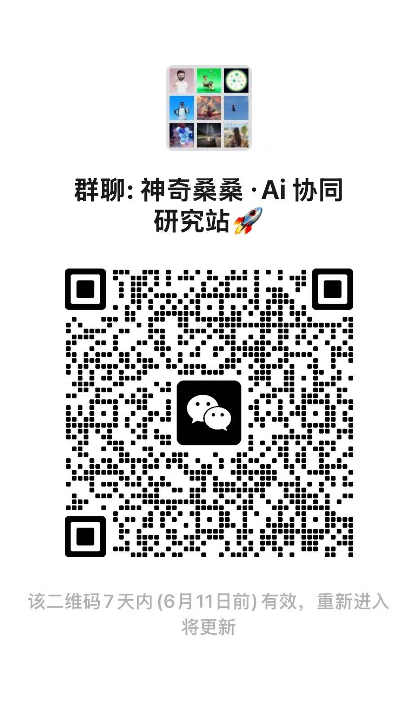

# 小红书直播回放下载

[English](README_EN.md)

一个小工具：复制小红书直播回放链接，一行命令下载视频。

> 作者目前只在 macOS 测试过。

---


## 为什么做这个

很多直播回放不能直接交给普通下载工具处理。

这个工具只做一件事：把小红书直播回放保存到本地。

## 功能

- 下载小红书直播回放
- 先检查链接，再决定是否下载
- 默认保存到 `~/Downloads`
- 不需要小红书账号
- 不读取浏览器 cookie
- 支持作为 AI Agent Skill 使用

## 安装

### 一行命令安装

```bash
curl -fsSL https://raw.githubusercontent.com/cyanskye/xhs-live-replay-downloader/main/install.sh | bash
```

### 或者 clone 安装

```bash
git clone https://github.com/cyanskye/xhs-live-replay-downloader.git
cd xhs-live-replay-downloader
npm install -g .
```

## 使用

### 先检查链接

```bash
xhs-live-replay --dry-run '<小红书直播回放链接>'
```

看到下面提示就说明可以下载：

```text
正在检查链接...
已找到可下载视频地址。
如果要下载，请去掉 --dry-run 再运行一次。
```

### 下载回放

```bash
xhs-live-replay '<小红书直播回放链接>'
```

视频默认保存到：

```text
~/Downloads
```

### 保存到指定目录

```bash
xhs-live-replay --output-dir ./downloads '<小红书直播回放链接>'
```

## 不安装直接用

```bash
npx github:cyanskye/xhs-live-replay-downloader --dry-run '<小红书直播回放链接>'
```

```bash
npx github:cyanskye/xhs-live-replay-downloader '<小红书直播回放链接>'
```

## 支持的链接

目前测试过：

```text
https://www.xiaohongshu.com/fe/live-h5/page/live_replay/...
https://www.xiaohongshu.com/hina/livereplay/...
```

如果链接已经失效、需要登录、需要验证码，工具会停止。

## AI Agent Skill

仓库里带了一个通用 Skill：

```text
skills/xhs-live-replay-downloader
```

安装好命令后，把这个文件夹放进支持 `SKILL.md` 的 AI 工具里。之后可以直接说：

```text
下载这个小红书直播回放：<链接>
```

## 交流与反馈

扫码加入「神奇桑桑・Ai 协同研究站」，交流 AI 协同工作流和实用工具。

> 二维码 7 天内有效，6 月 11 日前可用。如失效，请通过 GitHub profile 里的联系方式联系我。



## 更新

再次运行安装命令即可：

```bash
curl -fsSL https://raw.githubusercontent.com/cyanskye/xhs-live-replay-downloader/main/install.sh | bash
```

## 项目结构

```text
assets/         演示图片
bin/            命令行工具
skills/         AI Agent Skill
install.sh      macOS 安装脚本
README_EN.md    英文说明
```

## License

MIT

## Author

magicsang — [@cyanskye](https://github.com/cyanskye)
